<!-- ========================================================= -->
<!--                         HEADER                            -->
<!-- ========================================================= -->

<picture>
  <source
    media="(prefers-color-scheme: dark)"
    srcset="https://capsule-render.vercel.app/api?type=waving&height=220&section=header&text=Tanay%20Sarda&fontSize=55&fontColor=EF93C4&fontAlignY=38&desc=Developer%20%7C%20AI%20%7C%20Full%20Stack%20%7C%20Open%20Source&descAlignY=60&descSize=17&color=0D1117"
  />
  <source
    media="(prefers-color-scheme: light)"
    srcset="https://capsule-render.vercel.app/api?type=waving&height=220&section=header&text=Tanay%20Sarda&fontSize=55&fontColor=FF69B4&fontAlignY=38&desc=Developer%20%7C%20AI%20%7C%20Full%20Stack%20%7C%20Open%20Source&descAlignY=60&descSize=17&color=FFF5FA"
  />
  
</picture>

 

# Hey there, I'm Tanay Sarda 👋

  

<!-- ========================================================= -->
<!--                      GITHUB BADGES                        -->
<!-- ========================================================= -->

  

<!-- ========================================================= -->
<!--                       ABOUT ME                            -->
<!-- ========================================================= -->

## 🌸 About Me

<table>
<tr>

<td width="65%" align="left" valign="middle">

### Hey! I'm Tanay 👋

I'm a passionate developer who loves turning ideas into **real-world applications** and learning new technologies along the way.

- 💻 Building software and full-stack applications
- 🤖 Exploring Artificial Intelligence & Machine Learning
- 🌐 Interested in modern web development
- 🧠 Improving my Data Structures & Algorithms skills
- 🚀 Exploring open-source projects
- 🔧 Enjoy solving real-world technical problems
- 🌱 Constantly learning and experimenting
- ✨ Focused on writing clean and maintainable code

 

> **"Build something useful. Learn something new. Repeat."** 💗

</td>

<td width="35%" align="center">

</td>

</tr>
</table>

 

<!-- ========================================================= -->
<!--                       TECH STACK                          -->
<!-- ========================================================= -->

## 🛠️ Tech Stack

 

### 👨‍💻 Languages

  

### ⚡ Frameworks & Libraries

  

### 🗄️ Databases & Cloud

  

### 🔧 Tools & Platforms

  

<!-- ========================================================= -->
<!--                    GITHUB ANALYTICS                       -->
<!-- ========================================================= -->

## 📊 GitHub Analytics

 

<!-- GitHub Statistics -->

<picture>
  <source
    media="(prefers-color-scheme: dark)"
    srcset="./profile/stats-dark.svg"
  />
  <source
    media="(prefers-color-scheme: light)"
    srcset="./profile/stats-light.svg"
  />
  
</picture>

<!-- Top Languages -->

<picture>
  <source
    media="(prefers-color-scheme: dark)"
    srcset="./profile/top-langs-dark.svg"
  />
  <source
    media="(prefers-color-scheme: light)"
    srcset="./profile/top-langs-light.svg"
  />
  
</picture>

  

<!-- GitHub Streak -->

  

<!-- Activity Graph -->

<picture>
  <source
    media="(prefers-color-scheme: dark)"
    srcset="https://raw.githubusercontent.com/tanaysarda/tanaysarda/output/activity-graph-dark.svg"
  />
  <source
    media="(prefers-color-scheme: light)"
    srcset="https://raw.githubusercontent.com/tanaysarda/tanaysarda/output/activity-graph-light.svg"
  />
  
</picture>

  

<!-- ========================================================= -->
<!--                  CONTRIBUTION SNAKE                       -->
<!-- ========================================================= -->

## 🐍 Contribution Snake

 

<picture>
  <source
    media="(prefers-color-scheme: dark)"
    srcset="https://raw.githubusercontent.com/tanaysarda/tanaysarda/output/github-contribution-grid-snake-dark.svg"
  />
  <source
    media="(prefers-color-scheme: light)"
    srcset="https://raw.githubusercontent.com/tanaysarda/tanaysarda/output/github-contribution-grid-snake.svg"
  />
  
</picture>

  

<!-- ========================================================= -->
<!--                    CONNECT WITH ME                        -->
<!-- ========================================================= -->

## 💌 Connect With Me

 

   

### 💗 Thanks for visiting!

If you like what I build, consider giving my repositories a ⭐

 

<!-- ========================================================= -->
<!--                         FOOTER                            -->
<!-- ========================================================= -->

<picture>
  <source
    media="(prefers-color-scheme: dark)"
    srcset="https://capsule-render.vercel.app/api?type=waving&height=140&section=footer&color=0D1117&fontColor=EF93C4&text=%F0%9F%91%8B%20Keep%20Building%20%26%20Keep%20Growing!&fontSize=20&fontAlignY=65"
  />
  <source
    media="(prefers-color-scheme: light)"
    srcset="https://capsule-render.vercel.app/api?type=waving&height=140&section=footer&color=EF93C4&fontColor=FFFFFF&text=%F0%9F%91%8B%20Keep%20Building%20%26%20Keep%20Growing!&fontSize=20&fontAlignY=65"
  />
  
</picture>
